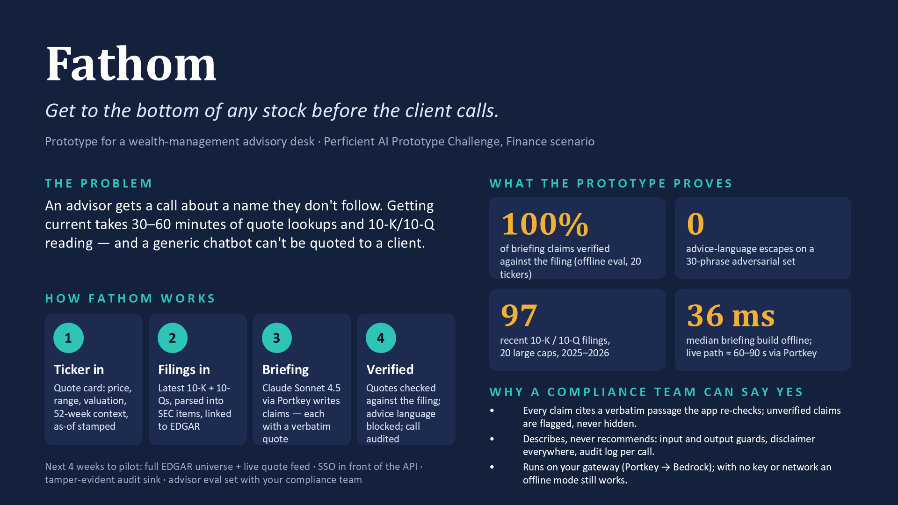

# Fathom

[](https://github.com/roshanrana/fathom/actions/workflows/check.yml)

Fathom takes a stock ticker and gives a wealth-management advisor one page to prepare for a
client call: the current quote with context (range, valuation, trend), the company's most
recent SEC filings with links to EDGAR, and an AI briefing of what those filings say that
matters — business snapshot, latest results, risks, liquidity, notable disclosures, talking
points. Every claim in the briefing carries a verbatim quote from the cited filing section,
checked by the application before it is shown. The advisor can then ask a follow-up question
grounded in the same filings.

It is not investment advice, does not make recommendations, and every surface carries a
disclaimer saying so.

## Why it is trustworthy

- **Verified citations, not trust.** Every claim (in a briefing or an answer) carries a
  `{text, source, quote}` triple. `verify_claim` normalises whitespace, case and quote glyphs
  and checks the quote is a real substring of the cited filing section before marking it
  `verified`. Unverified claims are shown with a warning badge, never silently dropped.
- **An advice-language guard, both ways.** A frozen pattern set (`fathom/guard.py`) blocks
  recommendation language ("you should buy", price targets, "strong buy", over/underweight,
  bullish/bearish, …) in both directions: a claim or answer that matches is replaced with a
  fixed removal notice and counted (`guard_hits`), and an advisor question that matches the
  same patterns gets a fixed no-advice answer without ever calling a provider.
- **An audit log for every provider call.** `fathom/audit.py` appends one JSON line per
  briefing, answer or probe to `audit/fathom-audit.jsonl`: timestamp, ticker, purpose, provider,
  model, latency, token counts, prompt/response hashes, claim and guard counts. Prompt/response
  bodies and the advisor's question text are never stored unless `FATHOM_AUDIT_BODIES=1` is set.
- **Offline by default.** The default `FATHOM_LLM_PROVIDER=offline` provider composes the same
  JSON contract extractively from the parsed filing sections — no network call, no API key — so
  the demo, the CLI, the tests and the CI gate all run the same pipeline a live call would use,
  and offline claims verify by construction.

## Run it in three commands

```bash
uv sync --all-extras
uv run python scripts/check.py
uv run fathom brief AAPL
```

The first command installs every optional extra (Streamlit, the MCP server, Playwright for
screenshots). The second is the one gate — lint, format, mypy strict, tests with coverage,
a secrets scan, the offline eval bench, and metrics/card drift checks — and is what CI runs on
every push. The third produces a real, grounded briefing for Apple with no API key. To see the
page instead of the CLI:

```bash
uv run fathom app
```

opens the Streamlit UI at <http://localhost:8501>: a ticker selector, the quote card, a one-year
chart, the filings table with EDGAR links, the briefing with verified/unverified badges, a
question box, and a status strip showing the active provider and model.

## Live mode

Fathom's provider is a one-variable switch (`FATHOM_LLM_PROVIDER`, default `offline`):

```bash
export FATHOM_LLM_PROVIDER=portkey
export PORTKEY_API_KEY=...            # required for the portkey provider
# export PORTKEY_BASE_URL=...         # default: https://portkeygateway.perficient.com/v1
# export PORTKEY_MODEL=...            # default: @aws-bedrock-use2/us.anthropic.claude-sonnet-4-5-20250929-v1:0
uv run fathom probe
```

`fathom probe` sends a tiny ping to the configured provider and prints the provider name, model,
latency and reply — the fastest way to check the gateway shape before a live demo. A missing key
raises `FathomError(PROVIDER_CONFIG)` naming only the missing variable, before any HTTP client is
built. `FATHOM_LLM_PROVIDER=anthropic` with `ANTHROPIC_API_KEY` talks to the Anthropic Messages
API directly as a second live path. Every call — offline, Portkey or Anthropic — is written to
the audit log.

## Live data (free, no API keys)

Separately from the LLM provider above, Fathom's *data* source (filings, prices, valuation
snapshot) is a one-variable switch, `FATHOM_DATA_SOURCE` (default `fixture`, the committed
20-ticker dataset). Live mode fetches any US-listed ticker known to SEC EDGAR from free,
unofficial-to-unofficial-and-official sources — no API key required:

```bash
export FATHOM_DATA_SOURCE=live
export FATHOM_SEC_CONTACT=<your.name@example.com>   # required in live mode (SEC fair-access policy)
# export FATHOM_LIVE_CACHE_DIR=.cache/live          # default
# export FATHOM_LIVE_TTL_HOURS=6                    # default
# export FATHOM_PRICE_SOURCE=yahoo                  # default; stooq is the automatic fallback
uv run fathom fetch NFLX --force
```

Sources and their terms:

- **SEC EDGAR** (official): the latest 10-K and up to four latest 10-Qs, `company_tickers.json`
  and XBRL company-concept facts. SEC's fair-access policy requires a contact address in the
  `User-Agent` header and caps requests at 10/second; Fathom sends `FATHOM_SEC_CONTACT` in the
  header and throttles itself to ≤ 8 requests/second, well under the cap. Live mode refuses to
  start without `FATHOM_SEC_CONTACT` set.
- **Yahoo Finance** (chart endpoint) and **Stooq** (CSV download) for daily price bars — both
  are **unofficial, undocumented endpoints that may change or block requests without notice**;
  Stooq is the automatic fallback when Yahoo fails, and Stooq returned a bot-challenge HTML page
  (not data) during our own probes, which is exactly the kind of failure the fallback and the
  `SOURCE_HTTP` error path exist for.
- **XBRL-derived valuation ratios are approximations**, not vendor figures: market cap, P/E, P/B
  and dividend yield are computed from SEC XBRL company-concept facts (shares outstanding,
  trailing diluted EPS, stockholders' equity, trailing dividends per share) combined with the
  latest close, not sourced from a pricing vendor's own calculation.

Live fetches are cached under `.cache/live/<TICKER>/` with a 6-hour TTL (`FATHOM_LIVE_TTL_HOURS`);
`fathom fetch TICKER --force` bypasses the cache and re-fetches everything. `quote`, `filings`,
`brief` and `ask` all accept `--source fixture` to go back to the committed dataset at any time.
See [`docs/design/05-m4-live-data.md`](docs/design/05-m4-live-data.md) for the full design and
[`docs/SHOWCASE.md`](docs/SHOWCASE.md) for a real `fathom fetch` run with its output pasted
verbatim.

## CLI, API, MCP

```bash
uv run fathom quote AAPL                              # reproducible quote snapshot
uv run fathom filings AAPL                            # 10-K/10-Q list with EDGAR links
uv run fathom brief AAPL --json                       # the Briefing contract as JSON
uv run fathom ask AAPL "What are the main risk factors?"
uv run fathom api                                      # FastAPI app on 127.0.0.1:8000
uv run fathom mcp                                      # MCP server over stdio (needs the `mcp` extra)
```

The HTTP API mirrors the CLI behind one envelope (`{ok, data, error, meta}`):
`GET /api/quote/{ticker}`, `GET /api/filings/{ticker}`, `POST /api/brief/{ticker}`,
`POST /api/ask/{ticker}` (body `{"question": "..."}`), `GET /healthz`. The MCP server exposes
`get_quote`, `list_filings`, `get_briefing`, `ask_filings` over the same contracts — see
[`docs/mcp.md`](docs/mcp.md) for the tool reference and host registration. Full walkthrough with
real output: [`docs/SHOWCASE.md`](docs/SHOWCASE.md).

## Metrics

<!-- metrics:start -->

| KPI | Value | Unit | Target | Status |
|---|---|---|---|---|
| Parser coverage (10-K Items 1A/7, 10-Q Item I.2) | 1.0 | ratio | 1.0 | pass |
| Golden-query retrieval hit rate | 0.7786 | ratio | ≥ 0.9 (informational) | info |
| Guard escapes (adversarial phrases) | 0 | count | 0 | pass |
| Guard false positives (benign phrases) | 0 | count | 0 | info |
| Offline briefing verified share | 1.0 | ratio | 0.9 | pass |
| Offline briefing latency, median | 33 | ms | 5000 | pass |
| Prompt-injection guard test | True | bool | True | pass |

<!-- metrics:end -->

Produced by `uv run fathom bench` (part of the gate) and rendered by `metrics/render.py`, which
also fails the gate (`--check`) on drift between `metrics/headline.json` and `metrics/card.md`.
The retrieval hit-rate target is informational per decision D-008: title-token boosting improved
it but did not clear 0.9 on this fixture set, and the card reports the measured value rather than
edit the threshold. See the full card at [`metrics/card.md`](metrics/card.md).

## Data sources

Four Hugging Face datasets, filtered to a 20-ticker universe and committed as fixtures by
`scripts/fetch_data.py` (never run by CI):

| Fixture | Dataset | Licence | Rows |
|---|---|---|---|
| `data/filings.parquet` | `musk1209/finsight-sec-filings` | MIT | 97 |
| `data/bars.parquet` | `AlphaDojo/dojo_stock_kline` | Apache-2.0 | 8480 |
| `data/quotes.parquet` | `AlphaDojo/dojo_quote` | Apache-2.0 | 20 |
| `data/companies.parquet` | `AlphaDojo/dojo_stock_info` | Apache-2.0 | 20 |

Full provenance, coverage and hand-checkable anchor values: [`data/SOURCES.md`](data/SOURCES.md).

## Design docs

Frozen design documents, in order: [`docs/design/00-problem-brief.md`](docs/design/00-problem-brief.md),
[`01-requirements.md`](docs/design/01-requirements.md), [`02-hld.md`](docs/design/02-hld.md),
[`02-threat-model.md`](docs/design/02-threat-model.md), [`03-lld.md`](docs/design/03-lld.md), and
the append-only decision log [`decisions.md`](docs/design/decisions.md). Task packs and their
verdicts are under [`docs/tasks/`](docs/tasks/); the hash-chained evidence ledger and per-task
verification/security records are under [`docs/evidence/`](docs/evidence/).

## What's inside

- [`docs/assurance-report.md`](docs/assurance-report.md) — the assurance report summarising gate results, coverage and residual risk.
- [`docs/ops/runbook.md`](docs/ops/runbook.md) — the operations runbook for running and recovering the service.
- [`docs/ops/orr.md`](docs/ops/orr.md) — the operational readiness review.
- [`docs/ops/change-record.md`](docs/ops/change-record.md) — the change record for this release.
- [`docs/ops/demo-checklist.md`](docs/ops/demo-checklist.md) — the pre-demo checklist.
- [`docs/pitch/fathom-pitch.pptx`](docs/pitch/fathom-pitch.pptx) — the one-slide pitch deck.

  
- [`docs/graph/README.md`](docs/graph/README.md) — the codebase knowledge graph.

## How it was built

Fathom was built under the Shipyard lifecycle — frozen design docs gated before implementation,
then a sequenced set of task packs, each independently verified — the same process as
[Lodestar](https://github.com/roshanrana/lodestar). See [`STATE.md`](STATE.md) for the task log,
budget ledger and gate log, and [`docs/design/decisions.md`](docs/design/decisions.md) for the
numbered decisions made along the way.

## Limits

- **20-ticker fixture universe**, not an architectural limit: AAPL, AMZN, BAC, CAT, CVX, GOOGL,
  GS, JNJ, JPM, KO, MCD, META, MSFT, NVDA, PFE, PG, TSLA, UNH, WMT, XOM. A ticker outside the set
  returns a clear "not in demo universe" error listing the supported tickers.
- **The "current quote" is a snapshot**, not a live feed: the latest committed daily bar and
  quote snapshot, as of 2026-09-11, stamped as-of on every metric. A live market-data adapter is
  a documented extension, not built.
- **The offline verified share (100%) is true by construction**, not a measure of live-model
  quality: the offline provider's claims are the filing sentences themselves, so they verify
  trivially. Live-mode verified share is not gated — it is reported per call in the audit log
  (decision D-005).
- See [`docs/ASSUMPTIONS.md`](docs/ASSUMPTIONS.md) for the full list, with owners.

## License

MIT.
