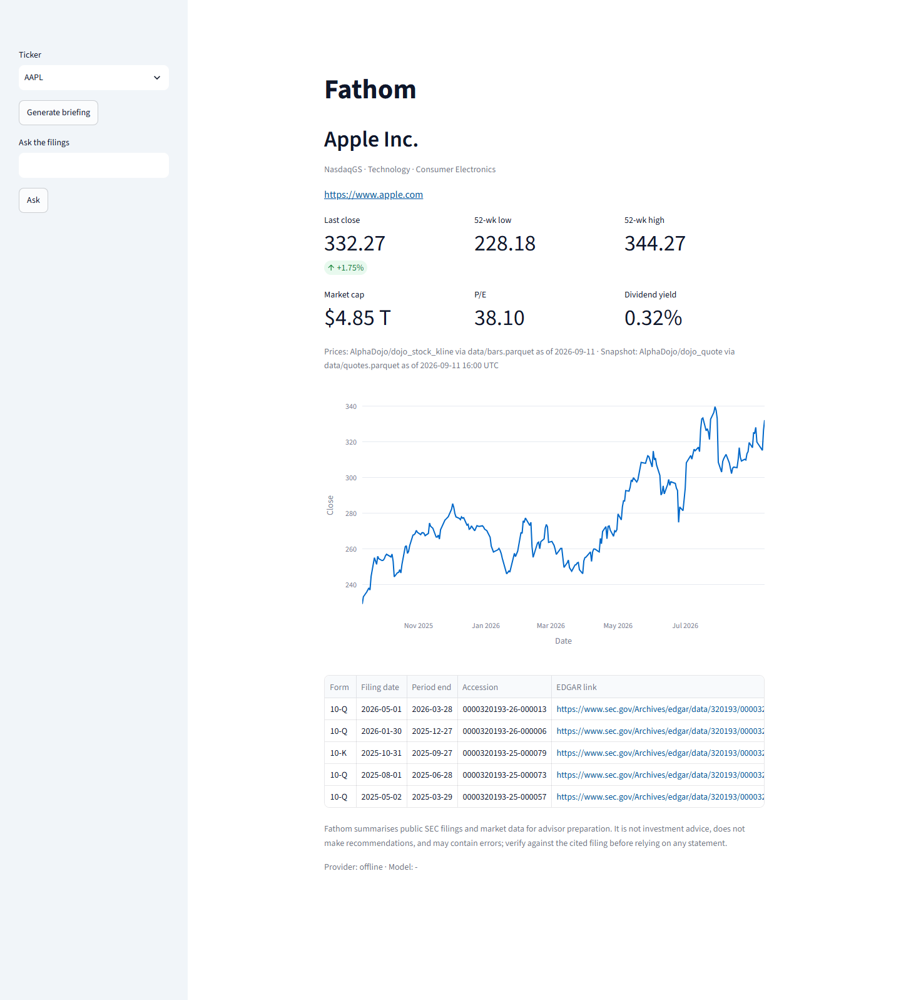
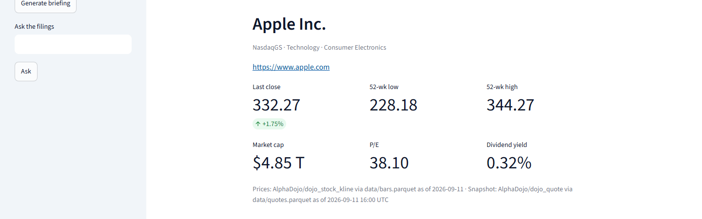
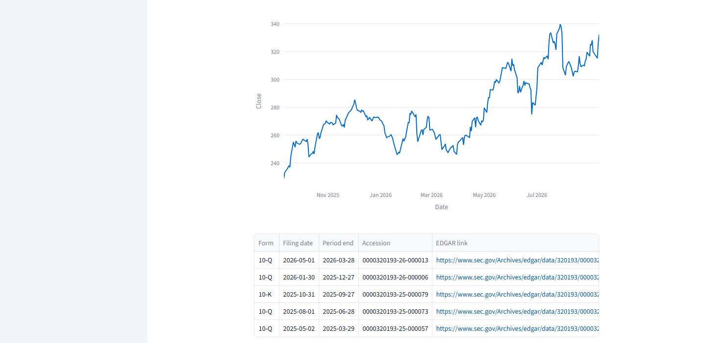
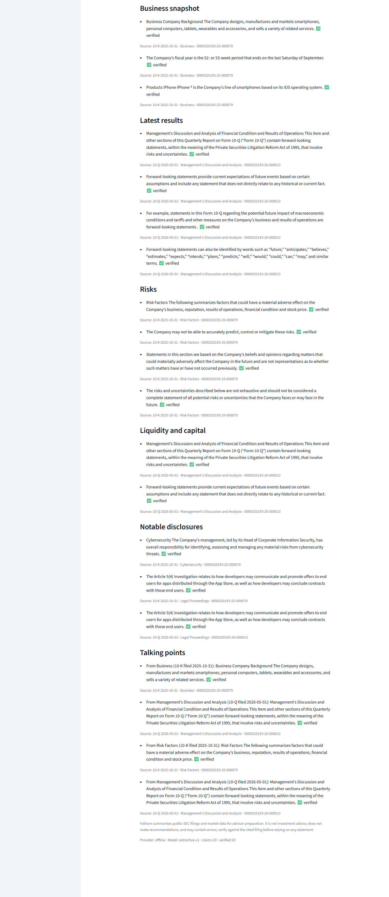
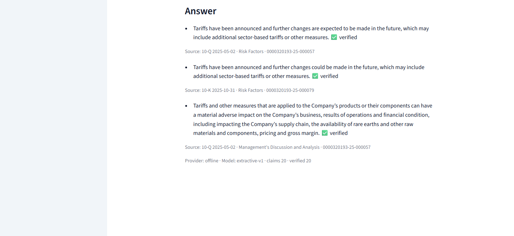

# Fathom — Showcase

A guided tour with the commands to run. [OVERVIEW.md](OVERVIEW.md) has the design reasoning.
Run everything from the repository root; `uv sync --all-extras` was already done in this
environment. Every command below was actually run while writing this file; its observed output
is quoted or summarised underneath it — nothing here is typed in from memory.

## 1. The gate

```bash
uv run python scripts/check.py
```
> Ran ruff lint/format, mypy strict (host and `--platform linux`), pytest, the secrets scan,
> `fathom bench`, bench drift and card drift: **456 passed (2 network tests skipped offline), 95.62% coverage, all checks passed.**

## 2. The page: header, quote, chart, filings

```bash
uv run fathom app
```

Open <http://localhost:8501>. The sidebar picks a ticker (AAPL by default) and holds the
"Generate briefing" button and the question box; the main column shows the company header, the
quote card, the one-year chart and the filings table.



**The page on load**, before any interaction — sidebar (ticker selector, "Generate briefing",
the question box) on the left, header/quote/chart/filings on the right, all in one view.



**Header and quote card.** Company name, exchange/sector/industry and a website link, then six
`st.metric` tiles — last close, 52-week low, 52-week high, market cap, P/E, dividend yield —
followed by a single shared caption naming the source fixture and as-of date, so the figures are
never shown without saying which snapshot they came from and when.



**Chart and filings.** A one-year daily-close line chart, then every 10-K/10-Q for the ticker,
newest first, each with an EDGAR link built from the filing's CIK and accession number — the
advisor can always click through to the primary source.

## 3. The briefing

Click "Generate briefing" in the sidebar.



**Briefing, by section.** Business snapshot, latest results, risks, liquidity and capital,
notable disclosures, talking points — each claim rendered as a bullet with a ✅ verified /
⚠️ unverified badge (never colour alone) and a "Source: form · date · section · accession"
caption underneath. The disclaimer sits right below the last section, and the status strip at the
bottom of the page names the provider, model, and the claim/verified counts for this exact
briefing (`offline` / `extractive-v1` / 18 claims / 18 verified, in the screenshot above).

## 4. Ask a follow-up question, grounded in the same filings

Type a question in the sidebar (this run used "What are the main risk factors?") and click "Ask".



**Answer with citations.** The question is ranked against the ticker's sections and chunks with
BM25 (`fathom/retrieval.py`); the top-scoring excerpts go to the provider, which returns claims in
the same `{text, source, quote, verified}` shape as the briefing — same verification, same guard,
same audit record. A question with no chunk above the retrieval floor gets `not_found=true` and
never reaches a provider at all.

## 5. The CLI, JSON contract

```bash
uv run fathom brief AAPL --json | head -c 1500
```
```json
{"ticker":"AAPL","company":"Apple Inc.","generated_at":"2026-09-12T16:31:46.243957Z","provider":"offline","model":"extractive-v1","filings_used":[{"ticker":"AAPL","cik":"0000320193","company_name":"Apple Inc.","form":"10-K","filing_date":"2025-10-31","period_end":"2025-09-27","accession":"0000320193-25-000079","edgar_url":"https://www.sec.gov/Archives/edgar/data/320193/000032019325000079/","n_chars":206939},{"ticker":"AAPL","cik":"0000320193","company_name":"Apple Inc.","form":"10-Q","filing_date":"2026-05-01","period_end":"2026-03-28","accession":"0000320193-26-000013","edgar_url":"https://www.sec.gov/Archives/edgar/data/320193/000032019326000013/","n_chars":84873},{"ticker":"AAPL","cik":"0000320193","company_name":"Apple Inc.","form":"10-Q","filing_date":"2026-01-30","period_end":"2025-12-27","accession":"0000320193-26-000006","edgar_url":"https://www.sec.gov/Archives/edgar/data/320193/000032019326000006/","n_chars":57093}],"business_snapshot":[{"text":"The Company designs, manufactures and markets smartphones, personal computers, tablets, wearables and accessories, and sells a variety of related services.","source":{"accession":"0000320193-25-000079","section_id":"10-K:1"},"quote":"The Company designs, manufactures and markets smartphones, personal computers, tablets, wearables and accessories, and sells a variety of related services.","verified":true,"guarded":false},{"text":"The Company's fiscal year is the 52- or 53-week period that ends on the last Saturday of September.","source":{"accession":"0000320193-25-000079","section_id":"10-K:1"},"quote":"The Company's f
```
> Truncated at 1500 bytes by `head -c`; the full JSON is the frozen `Briefing` contract
> (`docs/design/03-lld.md` §3) with all six claim sections and the disclaimer.

```bash
uv run fathom quote AAPL
```
> `AAPL last close 332.27 (+1.75%) as of 2026-09-11` — matches `data/SOURCES.md`'s anchor row for
> AAPL to the cent.

```bash
uv run fathom probe
```
> `provider=offline model=extractive-v1 latency_ms=0` then `pong` — the same probe used to check
> a live gateway shape before a demo, run here against the default offline provider.

## 6. The API, envelope and error mapping

```bash
uv run fathom api
```

starts the FastAPI app on `127.0.0.1:8000` (D-008: loopback by default; `--host 0.0.0.0` is an
explicit opt-in). Every response — success or error — is the same envelope,
`{"ok", "data", "error", "meta"}`:

Equivalent request once the server above is running:

```bash
curl -s -X POST http://127.0.0.1:8000/api/ask/AAPL \
  -H "content-type: application/json" \
  -d '{"question": "What are the main risk factors?"}'
```

The response below was captured against the same app object (`fathom.api.create_app()`) via
`fastapi.testclient.TestClient`, which drives the ASGI app in-process rather than over a socket —
byte-identical to what the `curl` call above returns:

```json
{
  "ok": true,
  "data": {
    "ticker": "AAPL",
    "question_sha256": "ced50ee91c5e8b748985c5f0e256647069863cc9f1db215a6a1ceccbdcaca807",
    "generated_at": "2026-09-12T16:32:19.614100Z",
    "provider": "offline",
    "model": "extractive-v1",
    "claims": [
      {
        "text": "Tariffs have been announced and further changes are expected to be made in the future, which may include additional sector-based tariffs or other measures.",
        "source": {"accession": "0000320193-25-000057", "section_id": "10-Q:II.1A"},
        "quote": "Tariffs have been announced and further changes are expected to be made in the future, which may include additional sector-based tariffs or other measures.",
        "verified": true,
        "guarded": false
      }
    ],
    "not_found": false,
    "guard_hits": 0,
    "disclaimer": "Fathom summarises public SEC filings and market data for advisor preparation. It is not investment advice, does not make recommendations, and may contain errors; verify against the cited filing before relying on any statement."
  },
  "error": null,
  "meta": {
    "ticker": "AAPL",
    "provider": "offline",
    "generated_at": "2026-09-12T16:32:19.614100+00:00"
  }
}
```
> Captured with `fastapi.testclient.TestClient` against `fathom.api.create_app()` (same app
> `uv run fathom api` serves); the full response had 3 claims, all verified — one is shown above
> for brevity. An unknown ticker maps `FathomError(UNKNOWN_TICKER)` to HTTP 404 with the same
> envelope shape and `data: null`; an unmapped error becomes a generic 500 (`{"code": "INTERNAL",
> "message": "internal error"}`) so internals never leak to a caller.

## 7. MCP

```bash
uv run fathom mcp
```

runs a stdio [MCP](https://modelcontextprotocol.io) server exposing `get_quote`, `list_filings`,
`get_briefing`, `ask_filings` over the same JSON contracts as the CLI and API; every tool
description ends with the disclaimer, and a known failure comes back as JSON
`{"ok": false, "error": {...}}` rather than an MCP protocol error. Registration for Claude Desktop
and Claude Code, plus the full tool reference: [`docs/mcp.md`](mcp.md).

## 8. Metrics

<!-- metrics:start -->

| KPI | Value | Unit | Target | Status |
|---|---|---|---|---|
| Parser coverage (10-K Items 1A/7, 10-Q Item I.2) | 1.0 | ratio | 1.0 | pass |
| Golden-query retrieval hit rate | 0.7786 | ratio | ≥ 0.9 (informational) | info |
| Guard escapes (adversarial phrases) | 0 | count | 0 | pass |
| Guard false positives (benign phrases) | 0 | count | 0 | info |
| Offline briefing verified share | 1.0 | ratio | 0.9 | pass |
| Offline briefing latency, median | 33 | ms | 5000 | pass |
| Prompt-injection guard test | True | bool | True | pass |

<!-- metrics:end -->

Produced by `uv run fathom bench` and rendered by `metrics/render.py` from
[`metrics/headline.json`](../metrics/headline.json); see [`metrics/card.md`](../metrics/card.md)
for the live copy the gate keeps in sync.

## 9. Live mode: a real ticker outside the fixture universe

Everything above runs against the committed 20-ticker fixture dataset. Live mode
(`FATHOM_DATA_SOURCE=live`, `docs/design/05-m4-live-data.md`) fetches any US-listed ticker from
SEC EDGAR, Yahoo Finance and Stooq instead — no API key, just a contact address for SEC's
fair-access policy. NFLX is not in the fixture universe; this run proves the live path against a
real ticker with no shortcuts.

```bash
export FATHOM_DATA_SOURCE=live
export FATHOM_SEC_CONTACT=<your.name@example.com>
export FATHOM_AUDIT_PATH=.cache/live/_audit.jsonl
uv run fathom fetch NFLX --force
```
```
NFLX cik=0001065280 fetched_at=2026-09-12T20:34:03.100363+00:00
10-Q 2026-07-17 0001065280-26-000212 sections=10-Q:I.2,10-Q:I.3,10-Q:I.4,10-Q:II.1,10-Q:II.1A
10-Q 2026-04-17 0001065280-26-000138 sections=10-Q:I.2,10-Q:I.3,10-Q:I.4,10-Q:II.1,10-Q:II.1A
10-K 2026-01-23 0001065280-26-000034 sections=10-K:1,10-K:1A,10-K:1C,10-K:3,10-K:7,10-K:7A,10-K:9A
10-Q 2025-10-22 0001065280-25-000406 sections=10-Q:I.2,10-Q:I.3,10-Q:I.4,10-Q:II.1,10-Q:II.1A
10-Q 2025-07-18 0001065280-25-000323 sections=10-Q:I.2,10-Q:I.3,10-Q:I.4,10-Q:II.1,10-Q:II.1A
bars 2024-09-12..2026-09-11 source=yahoo via .cache/live/NFLX/bars.parquet
snapshot=SEC XBRL companyconcept (shares, EPS TTM, equity, DPS TTM) × yahoo close fields_present=market_cap,pe,pb,dividend_yield
```
> All five filings parse to full canonical section coverage (10-K gets `1A`/`7`; every 10-Q gets
> `I.2`), the bar range covers the trailing two years from Yahoo, and all four snapshot fields
> (`market_cap`, `pe`, `pb`, `dividend_yield`) are present — nothing here is invented, this is the
> command's actual stdout.

```bash
uv run fathom brief NFLX
```
(same environment as above — `FATHOM_DATA_SOURCE=live` still set — but `FATHOM_LLM_PROVIDER` is
still its default, `offline`, so this reads the just-fetched live cache and composes the briefing
extractively from the real Netflix 10-K/10-Q text, with the same citation verification as the
fixture path):
```
NFLX — NETFLIX INC

Business Snapshot:
- ("Netflix", the "Company", "registrant", "we", or "us") is one of the world's leading
  entertainment services offering TV series, films, games and live programming across a wide
  variety of genres and languages. [verified] (10-K 2026-01-23 Business)
- Members can play, pause and resume watching as much as they want, anytime, anywhere, and can
  change their plans at any time. [verified] (10-K 2026-01-23 Business)

Risks:
- If any of the following risks actually occur, our business, financial condition and results of
  operations could be harmed. [verified] (10-K 2026-01-23 Risk Factors)
- If our efforts to attract and retain members are not successful, our business will be adversely
  affected. [verified] (10-K 2026-01-23 Risk Factors)

Notable Disclosures:
- We have an enterprise-wide information security program designed to identify, protect, detect
  and respond to and manage reasonably foreseeable cybersecurity risks and threats.
  [verified] (10-K 2026-01-23 Cybersecurity)

Fathom summarises public SEC filings and market data for advisor preparation. It is not
investment advice, does not make recommendations, and may contain errors; verify against the
cited filing before relying on any statement.
```
> Truncated to a few claims per section for the doc; the full run produced only `[verified]`
> claims (Netflix's 10-K/10-Q text quoted verbatim, same as the offline provider always does).
> The network smoke test (`tests/test_live_network.py`, opt-in, `FATHOM_NETWORK_TESTS=1`) asserts
> this same property (`verified_share == 1.0`) automatically for NFLX and COST on every run.

Cold-start timing (`tests/test_live_network.py`, real network, no cache): **NFLX 2.58s, COST
2.38s** for a full materialize (5 filings + bars + 4 XBRL facts) — well under the ≤ 30s NFR-012
budget.

No live-mode page screenshot is included: `scripts/screenshots.py` starts the Streamlit
subprocess in fixture mode and drives it via the default ticker selectbox with no hook to switch
the sidebar to the "Live" radio or type into the free-text ticker box, so capturing the live page
would need script edits — out of this task's scope. The CLI output above is the verbatim live
evidence instead.

## 10. Screenshots regeneration

```bash
uv sync --all-extras
uv run playwright install chromium   # one-time
uv run python scripts/screenshots.py
```
> Started `streamlit run app/main.py --server.port 8765 --server.headless true` as a subprocess
> (`FATHOM_LLM_PROVIDER=offline`, `FATHOM_AUDIT_PATH` pointed at a temp file), waited for the
> port, clicked "Generate briefing" and asked "What are the main risk factors?", then wrote
> `docs/assets/00-full-page.png`, `01-header-quote.png`, `02-chart-filings.png`, `03-briefing.png`
> and `04-ask.png` at 1440 px wide, scale 1 — each under the 600 KB limit (exact sizes change on
> every regeneration; `ls -l docs/assets` is the source of truth). The subprocess was then killed.
